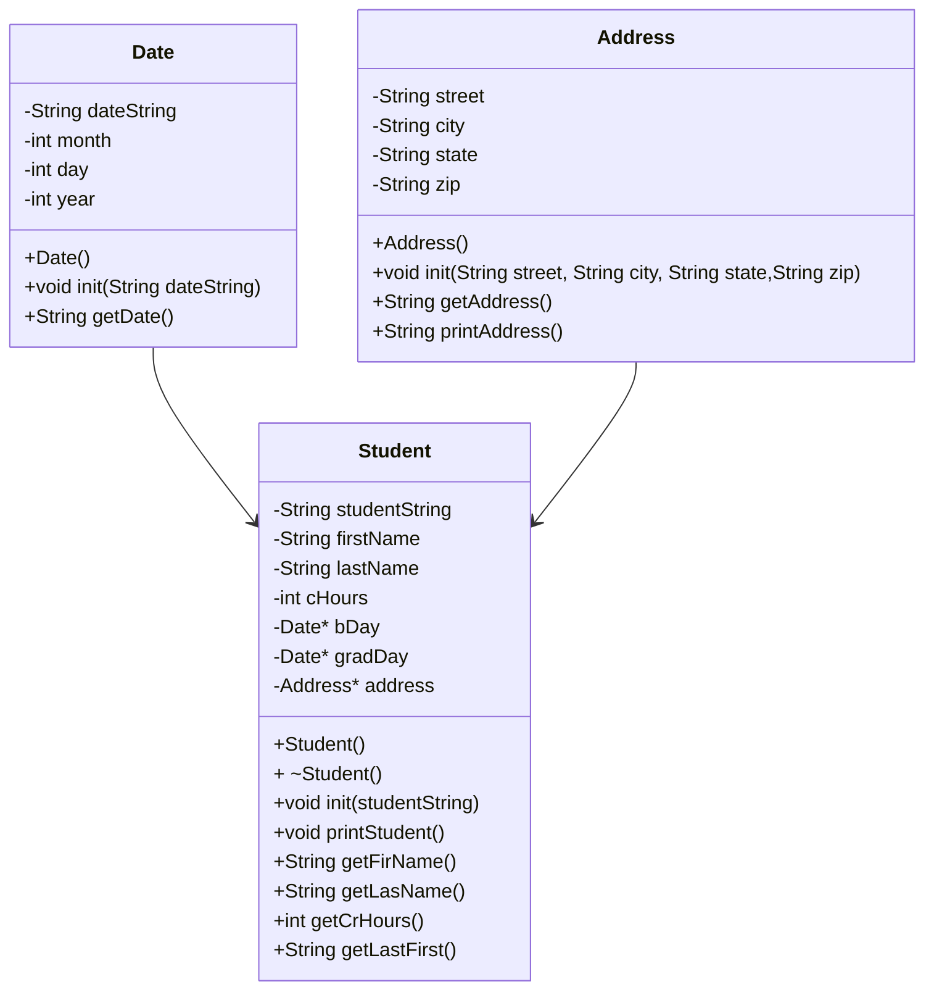

# CS121P7

```mermaid
classDiagram
    class Date{
        -String dateString
        -int month
        -int day
        -int year
        +Date()
        +void init(String dateString)
        +String getDate()
    }
    class Address{
        -String street
        -String city
        -String state
        -String zip
        +Address()
        +void init(String street, String city, String state,String zip)
        +String getAddress()
        +String printAddress()
    }
    class Student{
        -String studentString
        -String firstName
        -String lastName
        -int cHours
        -Date* bDay
        -Date* gradDay
        -Address* address
        +Student()
        + ~Student()
        +void init(studentString)
        +void printStudent()
        +String getFirName()
        +String getLasName()
        +int getCrHours()
        +String getLastFirst()
    }
    Date --> Student
    Address --> Student
```
